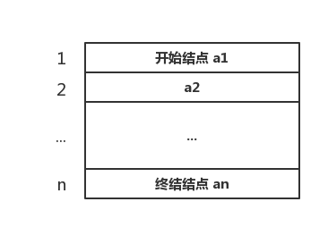

# 顺序表结构
> 顺序表（Sequential List）是按照 **顺序存储** 方式存储的线性表，该线性表的结点按照逻辑次序依次存放在计算机的一组连续的存储单元中。



由于顺序表是依次存放的，只要知道该顺序表的首地址以及每个结点所占的存储长度，即可算出任何一个结点的位置。假设顺序表中开始结点 a1 的存储地址是 `LOC(a1)` ，每个结点占用存储空间为 `C`,则结点 **ai** 的存储地址计算公式为：`LOC(ai) = LOC(a1) + (i - 1) * C` (1 <= i <= n)

## 顺序表操作实例代码

###数据准备
#### 定义顺序表结构

``` C
/** 顺序表最大长度 */
#define MAX_LEN 100
	
	
/** 顺序表操作返回值 */
typedef enum {
    RetError            = -1,           // 操作出错
    RetSuccess          = 0,            // 操作成功
} RetValue;
	
	
/** 顺序表节点类型 */
typedef struct {
    char key[15];                       // 学号
    char name[20];                      // 姓名
    int age;                            // 年龄
}NodeData;
	
	
/** 顺序表结构 */
typedef struct {
    NodeData listData[MAX_LEN];         // 保存顺序表的结构数组
    unsigned int listLen;               // 顺序表已有节点的数量
}SLType;
```

### 相关操作
#### 初始化顺序表
``` C
RetValue SLInit(SLType* slList)
{
    if (NULL == slList)
    {
        printf("顺序表不存在，无法进行初始化操作！\n");
        return RetError;
    }
    
    slList->listLen = 0;
    
    return RetSuccess;
}
```

#### 获取顺序表长度
``` C
unsigned int SLlength(SLType* slList)
{
    if (NULL == slList)
    {
        printf("顺序表不存在，无法进行获取顺序表长度操作！\n");
        return 0;
    }
    
    return slList->listLen;
}
```

#### 表尾追加节点数据
``` C
RetValue SLAdd(SLType* slList, NodeData nData)
{
    if (NULL == slList)
    {
        printf("顺序表不存在，无法进行追加新节点操作！\n");
        return RetError;
    }
    
    if (MAX_LEN <= slList->listLen)
    {
        printf("顺序表已满，无法追加新节点数据！\n");
        return RetError;
    }
    
    slList->listData[slList->listLen++] = nData;
    
    return RetSuccess;
}
```

#### 插入节点数据
``` C
RetValue SLInsert(SLType* slList, int index, NodeData nData)
{
    if (NULL == slList)
    {
        printf("顺序表不存在，无法进行插入新节点操作！\n");
        return RetError;
    }
    
    if (MAX_LEN <= slList->listLen)
    {
        printf("顺序表已满，无法插入新节点数据！\n");
        return RetError;
    }
    
    if (0 > index || slList->listLen <= index)
    {
        printf("插入节点下标错误，无法插入新节点数据！\n");
        return RetError;
    }
    
    for (int i = slList->listLen; i >= index; i--)
    {
        slList->listData[i] = slList->listData[i - 1];
    }
    slList->listData[index] = nData;
    slList->listLen++;
    
    return RetSuccess;
}
```

#### 删除节点数据
``` C
RetValue SLDelete(SLType* slList, int index)
{
    if (NULL == slList)
    {
        printf("顺序表不存在，无法进行删除节点操作！\n");
        return RetError;
    }
    
    if (0 == slList->listLen)
    {
        printf("顺序表为空，无法删除节点数据！\n");
        return RetError;
    }
    
    if (0 > index || slList->listLen <= index)
    {
        printf("插入节点下标错误，无法删除节点数据！\n");
        return RetError;
    }
    
    for (int i = index; i < slList->listLen - 1; i++)
    {
        slList->listData[i] = slList->listData[i + 1];
    }
    slList->listLen--;
    
    return RetSuccess;
}
```

#### 根据节点序号查找节点数据
``` C
NodeData* SLFindByIndex(SLType* slList, int index)
{
    if (NULL == slList)
    {
        printf("顺序表不存在，无法进行查找节点操作！\n");
        return NULL;
    }
    
    if (0 == slList->listLen)
    {
        printf("顺序表为空，无法查找节点数据！\n");
        return NULL;
    }
    
    if (0 > index || slList->listLen <= index)
    {
        printf("查找节点下标错误，无法查找节点数据！\n");
        return NULL;
    }
    
    return &(slList->listData[index]);
}
```

#### 根据关键字查找节点序号
``` C
int SLFindByKey(SLType* slList, char* key)
{
    if (NULL == slList)
    {
        printf("顺序表不存在，无法进行关键字查找节点操作！\n");
        return RetError;
    }
    
    if (0 >= slList->listLen)
    {
        printf("顺序表为空，无法查找关键字节点数据！\n");
        return RetError;
    }
    
    for (int i = 0; i < slList->listLen; i++)
    {
        if (0 == strcmp(key, slList->listData[i].key))
        {
            return i;
        }
    }
    printf("顺序表不存在关键字为：%s 的节点数据！\n", key);
    return RetError;
}
```

#### 显示所有节点数据
``` C
RetValue SLShowAll(SLType* slList)
{
    if (NULL == slList)
    {
        printf("顺序表不存在，无法进行显示所有节点操作！\n");
        return RetError;
    }
    
    if (0 >= slList->listLen)
    {
        printf("顺序表为空，无法显示所有节点数据！\n");
        return RetError;
    }
    
    for (int i = 0; i < slList->listLen; i++)
    {
        // 清空输出缓冲区
        fflush(stdout);
        printf("key = %-15s name = %-20s age = %d\n", slList->listData[i].key, slList->listData[i].name, slList->listData[i].age);
    }
    return RetSuccess;
}
```

## 优缺点
1. 优点：
	- 操作方便
	- 容易计算结点的位置，可以随机访问结点数据
2. 缺点：
	- 在插入结点或者删除结点时，，需要移动大量的数据
	- 如果数据比较多，很难以分配足够的连续存储空间，容易到时内存分配失败