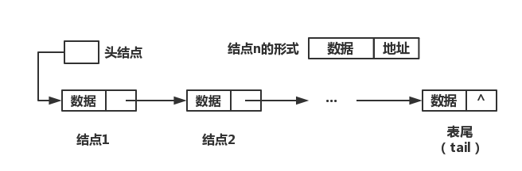

# 链表结构

> 链表（Linked List）结构是由许多结点依次**链接**而成，每个结点包括两部分：



1. 数据部分：保存的是该结点的实际数据
2. 地址部分：保存的是下一个结点的地址

## 链表分类
- 单链表：每个结点中只包含一个指针
- 双向链表：若每个结点包含两个指针，，一个指向下一个结点，另一个指向上一个结点
- 单向循环链表：在单链表中，将终端结点的指针域 NULL 改为指向头结点或开始结点
- 多重链的循环链表：如果将表中结点链在多个环上，将构成多重链的循环链表

## (常规)链表操作实例代码

### 数据准备
#### 定义链表结构
``` C
/** 链表操作返回值 */
typedef enum {
    RetError            = -1,           // 操作出错
    RetSuccess          = 0,            // 操作成功
} RetValue;


/** 链表结点类型 */
typedef struct {
    char key[15];                       // 学号
    char name[20];                      // 姓名
    int age;                            // 年龄
}NodeData;


/** 链表结构 */
typedef struct node {
    NodeData nodeData;                  // 保存结点数据
    struct node* nextNode;              // 保存下一结点的地址
}LLType;
```

### 相关操作
#### 表尾添加结点
``` C
LLType* LLAddEnd_1(LLType* head, NodeData data)
{
    LLType* newNode;
    if (!(newNode = (LLType*) malloc(sizeof(LLType))))
    {
        printf("新添加结点内存申请失败，无法在表尾添加结点！\n");
        return NULL;
    }
    newNode->nodeData = data;
    newNode->nextNode = NULL;
    if (NULL == head)
    {
        head = newNode;
        return head;
    }
    LLType* headTemp;
    headTemp = head;
    while (NULL != headTemp->nextNode)
    {
        headTemp = headTemp->nextNode;
    }
    headTemp->nextNode = newNode;
    
    return head;
}
```

#### 表头添加结点
``` C
LLType* LLAddHead_1(LLType* head, NodeData data)
{
    LLType* newNode;
    if (!(newNode = (LLType*)malloc(sizeof(LLType))))
    {
        printf("新添加结点内存申请失败，无法在表头添加结点！\n");
        return NULL;
    }
    newNode->nodeData = data;
    newNode->nextNode = head;
    head = newNode;
    
    return head;
}
```

#### 根据关键字查找结点
``` C
LLType* LLFindByKey_1(LLType* head, char* key)
{
    if (NULL == head)
    {
        printf("链表不存在，无法查找关键字结点！\n");
        return NULL;
    }
    if (NULL == key)
    {
        printf("关键字不存在，无法查找结点！\n");
        return NULL;
    }
    LLType* headTemp = head;
    while (headTemp)
    {
        if (0 == strcmp(headTemp->nodeData.key, key))
        {
            return headTemp;
        }
        headTemp = headTemp->nextNode;
    }
    return NULL;
}
```

#### 在关键字结点后插入结点数据
``` C
LLType* LLInsert_1(LLType* head, char* key, NodeData data)
{
    if (NULL == head)
    {
        printf("链表不存在，无法插入新结点！\n");
        return NULL;
    }
    if (NULL == key)
    {
        printf("关键字不存在，无法插入结点！\n");
        return head;
    }
    LLType* newNode;
    if (!(newNode = (LLType*)malloc(sizeof(LLType))))
    {
        printf("新添加结点内存申请失败，无法添加结点！\n");
        return head;
    }
    newNode->nodeData = data;
    LLType* findNode = LLFindByKey_1(head, key);
    if (findNode)
    {
        newNode->nextNode = findNode->nextNode;
        findNode->nextNode = newNode;
    }
    else
    {
        printf("找不到与关键字匹配的结点，无法插入结点！\n");
        free(newNode);
    }
    return head;
}
``` 

#### 根据关键字删除结点
``` C
RetValue LLDelete_1(LLType* head, char* key)
{
    if (NULL == head)
    {
        printf("链表不存在，无法删除关键字结点！\n");
        return RetError;
    }
    if (NULL == key)
    {
        printf("关键字不存在，无法删除结点！\n");
        return RetError;
    }
    LLType* findNode = head;
    LLType* headTemp = head;
    while (findNode)
    {
        if (0 == strcmp(findNode->nodeData.key, key))
        {
            headTemp->nextNode = findNode->nextNode;
            findNode->nextNode = NULL;
            free(findNode);
            
            return RetSuccess;
        }
        else
        {
            headTemp = findNode;
            findNode = findNode->nextNode;
        }
    }
    
    return RetError;
}
```

#### 计算链表长度
``` C
unsigned int LLLength_1(LLType* head)
{
    if (NULL == head)
    {
        printf("链表不存在，无法计算链表长度！\n");
        return 0;
    }
    LLType* headTemp = head;
    int length = 0;
    while (headTemp)
    {
        length++;
        headTemp = headTemp->nextNode;
    }
    
    return length;
}
``` 

#### 显示所有结点数据
``` C
void LLShowAll_1(LLType* head)
{
    if (NULL == head)
    {
        printf("链表不存在，无法显示所有结点！\n");
        return;
    }
    LLType* headTemp = head;
    while (headTemp)
    {
        printf("key = %-15s name = %-20s age = %d\n", headTemp->nodeData.key, headTemp->nodeData.name, headTemp->nodeData.age);
        headTemp = headTemp->nextNode;
    }
}
``` 


## （常规）链表优缺点
1. 优点：
	- 不需要分配一快连续的存储空间
	- 添加或删除结点时，不需要移动大量的结点数据
2. 缺点：
	- 浪费存储空间，需要额外保存一个指针变量
	- 无法随机访问，只能从链表头逐个查找
	- 表尾添加结点时，需要逐个结点循环查找表尾结点指针，速度慢

> 为了解决添加结点或者计算链表长度时，无需逐个结点循环查找表尾结点指针，可以特别定义一个 `头`，该**头**保存头结点地址，尾结点地址，链表长度等信息，以方便添加结点或者计算链表长度操作。

## (优化)链表操作实例代码

### 数据准备
#### 定义链表结构
``` C
/** 链表操作返回值 */
typedef enum {
    RetError            = -1,           // 操作出错
    RetSuccess          = 0,            // 操作成功
} RetValue;


/** 链表结点类型 */
typedef struct {
    char key[15];                       // 学号
    char name[20];                      // 姓名
    int age;                            // 年龄
}NodeData;


/** 链表结构 */
typedef struct node {
    NodeData nodeData;                  // 保存结点数据
    struct node* nextNode;              // 保存下一结点的地址
}LLType;
```

#### 定义“头”结构
``` C
/** 链表头 */
typedef struct _head {
    LLType* headNode;               // 保存链表头结点地址
    LLType* tailNode;               // 保存链表尾结点地址
    unsigned int clLength;          // 链表长度
}Head;
```

### 相关操作
#### 表尾添加结点
``` C
Head* LLAddEnd_2(Head* head, NodeData data)
{
    LLType* newNode;
    if (!(newNode = (LLType*) malloc(sizeof(LLType))))
    {
        printf("新添加结点内存申请失败，无法在表尾添加结点！\n");
        return NULL;
    }
    newNode->nodeData = data;
    newNode->nextNode = NULL;
    if (NULL == head)
    {
        head = (Head*)malloc(sizeof(Head));
        head->headNode = newNode;
        head->tailNode = newNode;
        head->clLength = 1;
        return head;
    }
    head->tailNode->nextNode = newNode;
    head->tailNode = newNode;
    head->clLength++;
    
    return head;
}
```

#### 表头添加结点
``` C
Head* LLAddHead_2(Head* head, NodeData data)
{
    LLType* newNode;
    if (!(newNode = (LLType*)malloc(sizeof(LLType))))
    {
        printf("新添加结点内存申请失败，无法在表头添加结点！\n");
        return NULL;
    }
    newNode->nodeData = data;
    if (NULL == head)
    {
        newNode->nextNode = NULL;
        head = (Head*)malloc(sizeof(Head));
        head->headNode = newNode;
        head->tailNode = newNode;
        head->clLength = 1;
        return head;
    }
    newNode->nextNode = head->headNode;
    head->headNode = newNode;
    head->clLength++;
    
    return head;
}
```

#### 根据关键字查找结点
``` C
LLType* LLFindByKey_2(Head* head, char* key)
{
    if (NULL == head)
    {
        printf("链表不存在，无法查找关键字结点！\n");
        return NULL;
    }
    if (NULL == key)
    {
        printf("关键字不存在，无法查找结点！\n");
        return NULL;
    }
    LLType* headTemp = head->headNode;
    while (headTemp)
    {
        if (0 == strcmp(headTemp->nodeData.key, key))
        {
            return headTemp;
        }
        headTemp = headTemp->nextNode;
    }
    
    return NULL;
}
```

#### 在关键字结点后插入结点数据
``` C
Head* LLInsert_2(Head* head, char* key, NodeData data)
{
    if (NULL == head)
    {
        printf("链表不存在，无法插入新结点！\n");
        return NULL;
    }
    if (NULL == key)
    {
        printf("关键字不存在，无法插入结点！\n");
        return head;
    }
    LLType* newNode;
    if (!(newNode = (LLType*)malloc(sizeof(LLType))))
    {
        printf("新添加结点内存申请失败，无法添加结点！\n");
        return head;
    }
    newNode->nodeData = data;
    LLType* findNode = LLFindByKey_2(head, key);
    if (findNode)
    {
        newNode->nextNode = findNode->nextNode;
        findNode->nextNode = newNode;
        head->clLength++;
    }
    else
    {
        printf("找不到与关键字匹配的结点，无法插入结点！\n");
        free(newNode);
    }
    
    return head;
}
```

#### 根据关键字删除结点
``` C
RetValue LLDelete_2(Head* head, char* key)
{
    if (NULL == head)
    {
        printf("链表不存在，无法删除关键字结点！\n");
        return RetError;
    }
    if (NULL == key)
    {
        printf("关键字不存在，无法删除结点！\n");
        return RetError;
    }
    LLType* findNode = head->headNode;
    LLType* headTemp = head->headNode;
    while (findNode)
    {
        if (0 == strcmp(findNode->nodeData.key, key))
        {
            headTemp->nextNode = findNode->nextNode;
            findNode->nextNode = NULL;
            free(findNode);
            head->clLength--;
            
            return RetSuccess;
        }
        else
        {
            headTemp = findNode;
            findNode = findNode->nextNode;
        }
    }
    
    return RetError;
}
```

#### 计算链表长度
``` C
unsigned int LLLength_2(Head* head)
{
    if (NULL == head)
    {
        printf("链表不存在，无法计算链表长度！\n");
        return 0;
    }
    return head->clLength;
}
```

### 显示所有结点数据
``` C
void LLShowAll_2(Head* head)
{
    if (NULL == head)
    {
        printf("链表不存在，无法显示所有结点！\n");
        return;
    }
    LLType* headTemp = head->headNode;
    while (headTemp)
    {
        printf("key = %-15s name = %-20s age = %d\n", headTemp->nodeData.key, headTemp->nodeData.name, headTemp->nodeData.age);
        headTemp = headTemp->nextNode;
    }
}
``` 

## 测试
### 获取系统时间（微秒）
``` C
long long getCurTimeOfUsec()
{
    struct timeval tv;
    gettimeofday(&tv,NULL);
    
    long long curUsec = tv.tv_sec * 1000000 + tv.tv_usec;
    
    return curUsec;
}
```

### （常规）链表添加节点测试
``` C
void test1()
{
    long long start = getCurTimeOfUsec();
    
    LLType* head = NULL;
    NodeData data;
    for (int i = 0; i < COUNT; i++)
    {
        strcpy(data.key, "1001");
        strcpy(data.name, "张三");
        data.age = i;
        
        head = LLAddEnd_1(head, data);
    }
    
    long long end = getCurTimeOfUsec();
    printf("常规总花费时间：%lld\n", end - start);
}
```

### （优化）链表添加节点测试
``` C
void test2()
{
    long long start = getCurTimeOfUsec();
    
    Head* head = NULL;
    NodeData data;
    for (int i = 0; i < COUNT; i++)
    {
        strcpy(data.key, "1002");
        strcpy(data.name, "李四");
        data.age = i;
        
        head = LLAddEnd_2(head, data);
    }
    
    long long end = getCurTimeOfUsec();
    printf("优化总花费时间：%lld\n", end - start);
}
```

经过测试，两种方式的链表结构，在链表尾添加结点时的时间对比数据如下：

1. 第一轮

	|   循环次数   |   常规（单位：µs）   |   优化（单位：µs）   |   时间差（单位：µs）   |
	|   -------   |   --------------    |    ------------    |   ----------------   |
	|   1         |      28             |        6           |       22             |
	|   10        |      25             |        6           |       19             |
	|   100       |      44             |        15          |       29             |
	|   1000      |      2320           |        210         |       2110           |
	|   10000     |      237870         |        1264        |       236606         |
	|   100000    |      21308344       |        10792       |       21297552       |

2. 第二轮

	|   循环次数   |   常规（单位：µs）   |   优化（单位：µs）   |   时间差（单位：µs）   |
	|   -------   |   --------------    |    ------------    |   ----------------   |
	|   1         |      33             |       17           |       16             |
	|   10        |      34             |       17           |       17             |
	|   100       |      80             |       29           |       51             |
	|   1000      |      2311           |       134          |       2177           |
	|   10000     |      208948         |       1203         |       207745         |
	|   100000    |      21355188       |       17013        |       21338175       |


3. 第三论

	|   循环次数   |   常规（单位：µs）   |   优化（单位：µs）   |   时间差（单位：µs）   |
	|   -------   |   --------------    |    ------------    |   ----------------   |
	|   1         |      18             |        17          |       1              |
	|   10        |      35             |        18          |       17             |
	|   100       |      63             |        40          |       23             |
	|   1000      |      1801           |        149         |       1652           |
	|   10000     |      205462         |        1184        |       204278         |
	|   100000    |      22253177       |        15876       |       22237301       |
	
4. 第四轮

	|   循环次数   |   常规（单位：µs）   |   优化（单位：µs）   |   时间差（单位：µs）   |
	|   -------   |   --------------    |    ------------    |   ----------------   |
	|   1         |      29             |        19          |       10             |
	|   10        |      20             |        18          |       2              |
	|   100       |      49             |        30          |       19             |
	|   1000      |      2229           |        127         |       2102           |
 	|   10000     |      281563         |        1235        |       280328         |
	|   100000    |      21770705       |        11681       |       21759024       |
	
5. 第五轮

	|   循环次数   |   常规（单位：µs）   |   优化（单位：µs）   |   时间差（单位：µs）   |
	|   -------   |   --------------    |    ------------    |   ----------------   |
	|   1         |      21             |        17          |       4              |
	|   10        |      20             |        18          |       2              |
 	|   100       |      48             |        34          |       14             |
	|   1000      |      2017           |        130         |       1887           |
	|   10000     |      203077         |        1369        |       201708         |
	|   100000    |      21622187       |        15273       |       21606914       |
	
6. 第六轮

	|   循环次数   |   常规（单位：µs）   |   优化（单位：µs）   |   时间差（单位：µs）   |
	|   -------   |   --------------    |    ------------    |   ----------------   |
	|   1         |      20             |        16          |       4              |
	|   10        |      20             |        20          |       0              |
	|   100       |      48             |        27          |       21             |
	|   1000      |      1957           |        128         |       1829           |
	|   10000     |      204941         |        1282        |       203659         |
	|   100000    |      22003134       |        11628       |       21991506       |
	
7. 第七轮

	|   循环次数   |   常规（单位：µs）   |   优化（单位：µs）   |   时间差（单位：µs）   |
	|   -------   |   --------------    |    ------------    |   ----------------   |
	|   1         |      18             |        17          |       1              |
	|   10        |      21             |        22          |       -1             |
	|   100       |      44             |        31          |       13             |
	|   1000      |      1925           |        133         |       1792           |
	|   10000     |      210657         |        1232        |       209425         |
	|   100000    |      22019334       |        12332       |       22007002       |

8. 第八轮

	|   循环次数   |   常规（单位：µs）   |   优化（单位：µs）   |   时间差（单位：µs）   |
	|   -------   |   --------------    |    ------------    |   ----------------   |
	|   1         |      19             |        18          |       1              |
	|   10        |      20             |        19          |       1              |
	|   100       |      102            |        26          |       76             |
	|   1000      |      1921           |        174         |       1747           |
	|   10000     |      219983         |        1230        |       218753         |
	|   100000    |      22104905       |        12201       |       22092704       |
	
9. 第九轮

	|   循环次数   |   常规（单位：µs）   |   优化（单位：µs）   |   时间差（单位：µs）   |
	|   -------   |   --------------    |    ------------    |   ----------------   |
	|   1         |      22             |        17          |       5              |
	|   10        |      20             |        20          |       0              |
	|   100       |      50             |        29          |       21             |
	|   1000      |      1971           |        132         |       1839           |
	|   10000     |      209878         |        1231        |       208647         |
	|   100000    |      22326454       |        11719       |       22314735       |
	
10. 第十轮

	|   循环次数   |   常规（单位：µs）   |   优化（单位：µs）   |   时间差（单位：µs）   |
	|   -------   |   --------------    |    ------------    |   ----------------   |
	|   1         |      36             |        17          |       19             |
	|   10        |      21             |        17          |       4              |
	|   100       |      66             |        28          |       38             |
	|   1000      |      1911           |        131         |       1780           |
	|   10000     |      211644         |        1156        |       210488         |
	|   100000    |      21856814       |        11484       |       21845330       |
	
11. 平均值

	|   循环次数   |   常规（单位：µs）   |   优化（单位：µs）   |   时间差（单位：µs）   |
	|   -------   |   --------------    |    ------------    |   ----------------   |
	|   1         |      24.4           |        16.1        |       8.3            |
	|   10        |      23.6           |        17.5        |       6.1            | 
	|   100       |      59.4           |        28.9        |       30.5           |        
	|   1000      |      2036.3         |        144.8       |       1891.5         |   
	|   10000     |      291402.3       |        1238.6      |       218163.7       |  
	|   100000    |      21862024.      |        12999.9     |       21849024.3     |
	
## 结论
由此可见，在链表数据结构中，如果添加结点的操作比较频繁，使用 `优化` 的链表结构更快捷、方便。