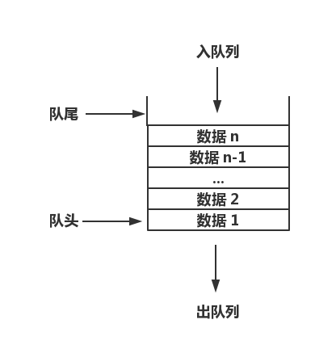

# 队列结构
> 队列（Queue）是从数据的运算来分类的，按照 `先进先出（First In First Out，FIFO）` 的原则处理结点数据的。而从数据的逻辑结构来看，队列结构其实就是一种线性结构。



## 队列结构包括两类
1. 顺序队列结构：使用一组地址连续的内存单元依次保存队列中的数据。
2. 链式队列结构：使用链表形式保存队列中的数据。

## (顺序)队列操作实例代码

### 数据准备
#### 定义（顺序）队列结构
``` C
/** 队列的最大长度 */
#define MAX_LEN 100


/** 队列作返回值 */
typedef enum {
    RetError            = -1,           // 操作出错
    RetFailure          = 0,            // 操作失败
    RetSuccess          = 1,            // 操作成功
}RetValue;


/** 队列结点类型 */
typedef struct {
    char key[15];                       // 学号
    char name[20];                      // 姓名
    int age;                            // 年龄
}NodeData;


/** (顺序)队列结构 */
typedef struct {
    NodeData QueueData[MAX_LEN];        // 数据元素
    int head;                           // 队头位置（出队列）
    int tail;                           // 队尾位置（入队列）
}SQType;
```
### （顺序）队列相关操作
#### （顺序）队列初始化
``` C
SQType* SQueueInit()
{
    SQType* pQueue;
    if (!(pQueue = (SQType*)malloc(sizeof(SQType))))
    {
        printf("无法分配队列内存，（顺序）队列初始化失败！\n");
        return NULL;
    }
    pQueue->head = 0;
    pQueue->tail = 0;
    return pQueue;
}
```

#### （顺序）空队列判断
``` C
RetValue SQueueIsEmpty(SQType* pQueue)
{
    if (NULL == pQueue)
    {
        printf("（顺序）队列指针不存在，无法进行空队列判断！\n");
        return RetError;
    }
    
    if (pQueue->tail == pQueue->head)
    {
        return RetSuccess;
    }
    else
    {
        return RetFailure;
    }
}
```

#### （顺序）满队列判断
``` C
RetValue SQueueIsFull(SQType* pQueue)
{
    if (NULL == pQueue)
    {
        printf("（顺序）队列指针不存在，无法进行满队列判断！\n");
        return RetError;
    }
    
    if (MAX_LEN == pQueue->tail)
    {
        return RetSuccess;
    }
    else
    {
        return RetFailure;
    }
}
```

#### （顺序）队列清空
``` C
RetValue SQueueClear(SQType* pQueue)
{
    if (NULL == pQueue)
    {
        printf("（顺序）队列指针不存在，无法进行队列清空！\n");
        return RetError;
    }
    
    pQueue->head = 0;
    pQueue->tail = 0;
    return RetSuccess;
}
```

#### （顺序）队列释放
``` C
RetValue SQueueFree(SQType* pQueue)
{
    if (NULL == pQueue)
    {
        printf("（顺序）队列指针不存在，无法进行队列释放！\n");
        return RetError;
    }
    
    free(pQueue);
    return RetSuccess;
}
```

#### 入（顺序）队列
``` C
RetValue SQueueIn(SQType* pQueue, NodeData inData)
{
    if (NULL == pQueue)
    {
        printf("（顺序）队列指针不存在，无法入队列！\n");
        return RetError;
    }
    if (RetSuccess == SQueueIsFull(pQueue))
    {
        printf("（顺序）队列已满，无法入队列！\n");
        return RetFailure;
    }
    
    pQueue->QueueData[pQueue->tail] = inData;
    pQueue->tail++;
    
    return RetSuccess;
}
```

#### 出（顺序）队列
``` C
RetValue SQueueOut(SQType* pQueue, NodeData* outData)
{
    if (NULL == pQueue)
    {
        printf("（顺序）队列指针不存在，无法出队列！\n");
        return RetError;
    }
    if (RetSuccess == SQueueIsEmpty(pQueue))
    {
        printf("（顺序）队列为空，无法出队列！\n");
        return RetFailure;
    }
    
    *outData = pQueue->QueueData[pQueue->head];
    pQueue->head++;
    
    return RetSuccess;
}
```

#### 读取（顺序）队头结点数据
``` C
RetValue SQueuePeek(SQType* pQueue, NodeData* peekData)
{
    if (NULL == pQueue)
    {
        printf("（顺序）队列指针不存在，无法读取队列顶数据！\n");
        return RetError;
    }
    if (RetSuccess == SQueueIsEmpty(pQueue))
    {
        printf("（顺序）队列为空，队列顶数据不存在！\n");
        return RetFailure;
    }
    
    *peekData = pQueue->QueueData[pQueue->head];
    
    return RetSuccess;
}
```

#### 计算（顺序）队列长度
``` C
unsigned int SQueueLength(SQType* pQueue)
{
    if (NULL == pQueue)
    {
        printf("（顺序）队列指针不存在，无法计算队列长度！\n");
        return 0;
    }
    unsigned int qLen = pQueue->tail - pQueue->head;

    return qLen;
}
```

#### 显示（顺序）队列所有数据
``` C
RetValue SQueueShowAll(SQType* pQueue)
{
    if (NULL == pQueue)
    {
        printf("（顺序）队列指针不存在，无法显示队列所有数据！\n");
        return RetError;
    }
    if (RetSuccess == SQueueIsEmpty(pQueue))
    {
        printf("（顺序）队列为空，队列数据不存在！\n");
        return RetFailure;
    }
    
    for (int i = pQueue->head; i < pQueue->tail; i++)
    {
        printf("key = %-15s name = %-20s age = %d\n", pQueue->QueueData[i].key, pQueue->QueueData[i].name, pQueue->QueueData[i].age);
    }
    return RetSuccess;
}
```

## (链式)队列操作实例代码

### 数据准备
#### 定义（链式）队列结构
``` C
/** 队列作返回值 */
typedef enum {
    RetError            = -1,           // 操作出错
    RetFailure          = 0,            // 操作失败
    RetSuccess          = 1,            // 操作成功
}RetValue;


/** 队列结点类型 */
typedef struct {
    char key[15];                       // 学号
    char name[20];                      // 姓名
    int age;                            // 年龄
}NodeData;


/** （链式）队列结构 */
typedef struct node {
    NodeData nodeData;                  // 保存结点数据
    struct node* nextNode;              // 保存下一结点的地址
}LQType;
```

#### 定义“头”结构
``` C
/** 链表头 */
typedef struct _head {
    LQType* headNode;                   // 保存队头结点地址（出队列）
    LQType* tailNode;                   // 保存队尾结点地址（入队列）
    unsigned int lqLength;              // 队列长度
}Head;
```

### （链式）队列相关操作
#### （链式）队列初始化
``` C
Head* LQueueInit()
{
    Head* pHead;
    if (!(pHead = (Head*)malloc(sizeof(Head))))
    {
        printf("无法分配队列头指针内存，（链式）队列初始化失败！\n");
        return NULL;
    }
    pHead->headNode = NULL;
    pHead->tailNode = NULL;
    pHead->lqLength = 0;
    
    return pHead;
}
```

#### 空（链式）队列判断
``` C
RetValue LQueueIsEmpty(Head* pHead)
{
    if (NULL == pHead)
    {
        printf("（链式）队列指针不存在，无法进行为空判断！\n");
        return RetError;
    }
    if (0 == pHead->lqLength)
    {
        return RetSuccess;
    }
    return RetFailure;
}
```

#### 入（链式）队列
``` C
RetValue LQueueIn(Head* pHead, NodeData inData)
{
    if (NULL == pHead)
    {
        printf("（链式）队列指针不存在，无法入队列\n");
        return RetError;
    }
    LQType* newNode;
    if (!(newNode = (LQType*) malloc(sizeof(LQType))))
    {
        printf("新添加结点内存申请失败，无法入队列！\n");
        return RetFailure;
    }
    newNode->nodeData = inData;
    newNode->nextNode = NULL;
    if (NULL == pHead->tailNode)
    {
        pHead->headNode = newNode;
    }
    else
    {
        pHead->tailNode->nextNode = newNode;
    }
    pHead->tailNode = newNode;
    pHead->lqLength++;
    
    return RetSuccess;
}
```

#### 出（链式）队列
``` C
RetValue LQueueOut(Head* pHead, NodeData* outData)
{
    if (NULL == pHead)
    {
        printf("（链式）队列指针不存在，无法入队列\n");
        return RetError;
    }
    if (RetSuccess == LQueueIsEmpty(pHead))
    {
        printf("队列内无结点，无法出队列！\n");
        return RetFailure;
    }
    
    memcpy(outData, &pHead->headNode->nodeData, sizeof(NodeData));
    
    LQType* deleteNode = pHead->headNode;
    
    pHead->headNode = pHead->headNode->nextNode;
    pHead->lqLength--;
    
    free(deleteNode);
    
    return RetSuccess;
}
```


#### 销毁（链式）队列
``` C
RetValue LQueueDestroy(Head* pHead)
{
    if (NULL == pHead)
    {
        printf("（链式）队列指针不存在，无法销毁队列\n");
        return RetError;
    }
    LQType* deleteNode;
    while (pHead->headNode)
    {
        deleteNode      = pHead->headNode;
        pHead->headNode = pHead->headNode->nextNode;
        free(deleteNode);
    }
    pHead->tailNode = NULL;
    pHead->headNode = NULL;
    free(pHead);
    
    return RetSuccess;
}
```

#### 读取（链式）队头数据
``` C
RetValue LQueuePeek(Head* pHead, NodeData* peekData)
{
    if (NULL == pHead)
    {
        printf("（链式）队列指针不存在，无法读取队列顶数据！\n");
        return RetError;
    }
    if (RetSuccess == LQueueIsEmpty(pHead))
    {
        printf("（链式）队列为空，队列顶数据不存在！\n");
        return RetFailure;
    }
    
    *peekData = pHead->headNode->nodeData;
    
    return RetSuccess;
}
```

#### 显示（链式）队列所有结点数据
``` C
RetValue LQueueShowAll(Head* pHead)
{
    if (NULL == pHead)
    {
        printf("(链式)队列指针不存在，无法显示队列所有数据！\n");
        return RetError;
    }
    if (RetSuccess == LQueueIsEmpty(pHead))
    {
        printf("（链式）队列为空，队列数据不存在！\n");
        return RetFailure;
    }
    LQType* tempHead = pHead->headNode;
    while (tempHead)
    {
        printf("key = %-15s name = %-20s age = %d\n", tempHead->nodeData.key, tempHead->nodeData.name, tempHead->nodeData.age);
        tempHead = tempHead->nextNode;
    }
    return RetSuccess;
}
```