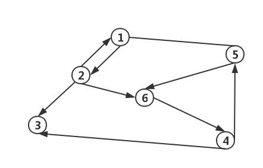
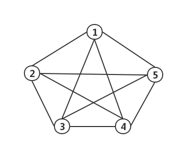
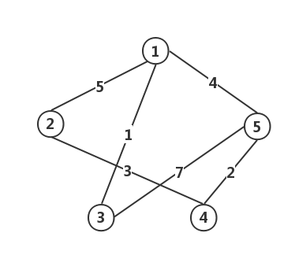
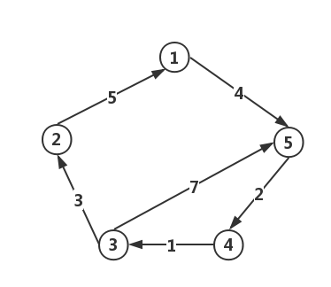
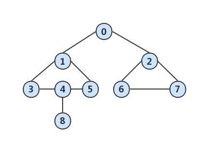
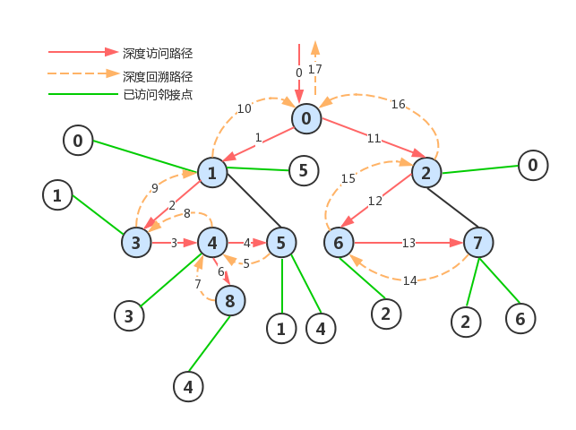
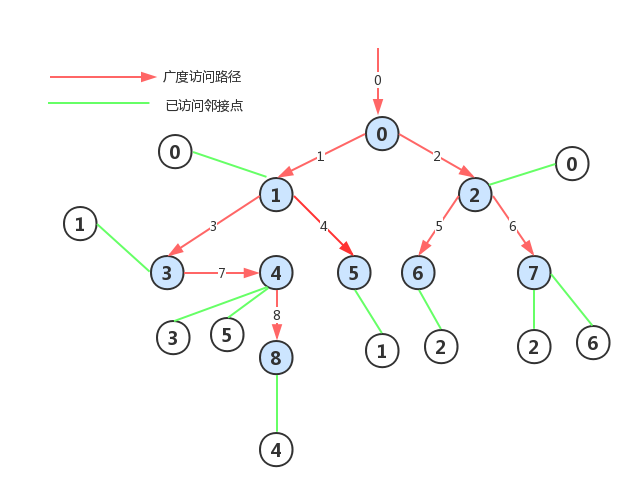

# 图结构
> 图（Graph）结构也是是一种描述`非线性关系`的数据结构。在`树`结构中，结点之间是具有层次关系的，每一层的结点可以和多个下层结点关联，但是只能和一个上层结点关联。而**图**结构中，每个结点之间可以任意关联。


## 组成
1. 顶点（Vertex）：图中的结点。
2. 边（Edge）：图中连接结点的线。

> 所有的顶点构成一个**顶点集合**，所有的边构成一个**边集合**，一个完整的图结构就是由顶点集合和边集合组成。在数学上一般标记为：`G = (V, E)` 或者 `G = (V(G), E(G))`

**注意**：图结构中顶点集合 `V(G)` 必须为非空，即必须包含一个顶点；而边集合可以为空，此时表示没有边。

## 图的基本概念
1. 无向图：如果一个图结构中，所有边都没有方向性，则称为无向图（表示边时，对两个顶点的顺序没有要求，用圆括号表示：`(V3, V4)` ）。
	
2. 有向图：如果一个图结构中，边是有方向性的，则称为有向图（表示边时，对两个顶点的顺序有所要求，用尖括号表示：`<V3, V4>` ）。
	
3. 顶点的度（Degree）：连接顶点的边的数量称为该顶点的**度**（在无向图中，简单记为：`D(V)`；在有向图中，`D(V) = OD(V) + ID(V)` ）。
	- 出度：是以该顶点为端点的**出边**数量，记为：`OD(V)`。
	- 入度：是以该顶点为端点的**入边**数量，记为：`ID(V)`。
4. 邻接顶点：是指图结构中一条边的两个顶点（在有向图中，区分为：起始顶点（起点或始点）和结束顶点（终点） ）。
	- 入边邻接顶点：连接该顶点的边中的起始顶点。
	- 出边邻接顶点：连接该顶点的边中的结束顶点。
5. 无向完全图：如果在一个无向图结构中，每两个顶点之间都存在一条边，则称为无向完全图（N 个顶点的无向完全图，其总边数为：`(N * (N - 1)) / 2`）。
	
6. 有向完全图：如果在一个有向图结构中，每两个顶点之间都存在**方向相反**的两条边，则称为有向完全图（N 个顶点的有向完全图，其总边数为：`(N * (N - 1))`。
	
7. 子图：如果一个图结构的顶点**和**边**都是**另一个图结构的**子集合**，则称该图结构是另一个图结构的子图。
8. 路径：是指图结构中两个顶点之间的连线，路径上**边的数量**称之为`路径长度`。
	- 简单路径：在图结构中，如果一条路径上顶点不重复出现，则称之为简单路径。
	- 环（回路）：在图结构中，如果路径的第一个顶点和路径的最后一个顶点相同，则称之为环，有时也称之为回路。
	- 简单回路：在图结构中，如果除第一个顶点和最后一个顶点相同外，其余各顶点都不重复的回路称为简单回路。
9. 连通：如果图结构中，两个顶点之间有路径，则称这两个顶点是连通的（注意：连通的两个顶点可以不是邻接顶点，只要有路径连接即可，可以途径多个顶点）。
10. 连通图（无向图）：如果无向图中任意两个顶点都是连通的，则称之为连通图（如果无向图结构图中，包含两个顶点是不连通的，则称之为非连通图）。
11. 连通分量：无向图的**极大连通子图**（即任意连通子图都是连通分量）称为该图的连通分量。
12. 强连通图（有向图）：
	- 如果两个顶点之间有路径，也称为这两个顶点是连通的（注意：有向图中边是有方向的。因此，有时从 `V1` 到 `V2` 是连通的，但从 `V2` 到 `V1` 却不一定连通）。
	- 如果有向图中任意两个顶点都是连通的，，则称之为**强连通图**（如果有向图中包含两个顶点不是连通的，，则称之为**非强连通图**）。
13. 强连通分量：有向图的**极大连通子图**（即任意强连通子图都是强连通分量）称为该图的连通分量（强连通图只有一个强连通分量，那就是该图本事）。
14. 权（Weight）：在实际应用中需要将边表示成某种数值，这个数值便是该边的权（无向图中加入权值，则称之为`无向带权图`；有向图中加入权值，则称之为`有向带权图`）。
	
	
15. 网：网就是边上带有权值的图的另一种名称。

## 图的遍历
> 图的遍历是指从图中的某一顶点出发，按照一定的策略访问图中的每一个顶点。而且每个顶点有且只能被访问一次；也是将网络结构按某种规则线性化的过程。对图的遍历通常有**"深度优先搜索（遍历）"**和**"广度优先搜索（遍历）"**方法。

### 深度优先搜索（Depth First Search：DFS）
1. 算法思路：类似树的**先根遍历**。设初始化时，图中各顶点均未被访问，从图中某个顶点(设为`V0`)出发，访问`V0`；然后搜索`V0`的**一个**邻接点`Vi`,若`Vi`未被访问，则访问之；再搜索`Vi`的一个邻接点(深度优先);不断地沿着顶点的深度方向（顶点的邻接点方向）遍历...。若某顶点的邻接点全部访问完毕，则回溯(Backtracking)到它的上一顶点，然后再从此顶点又按深度优先的方法搜索下去，...，直到能访问的顶点都访问完毕为止。

	
	
### 广度优先搜索（Breadth First Search：BFS）
1. 算法思路：类似树的**按层次遍历**。设初始时，图中各顶点均未被访问，从图中某顶点(设为`V0`)出发，访问`V0`，并依次访问`V0`的**各个**邻接点(广度优先)。然后，分别从这些**被访问过**的顶点出发，仍按照广度优先的策略搜索其它顶点，先访问顶点的邻接点**先于**后访问顶点的邻接点被访问....直到能访问的顶点都访问完毕为止。
2. 技巧：为控制广度优先的正确搜索，要用到**队列**技术，即访问完一个顶点后，让该顶点的序号入队。然后取相应队头(出队),考察访问过的顶点的各邻接点，将未访问过的邻接点访问 后再依次进队，...，直到队空为止。

	
	


## 图操作实例代码

### 数据准备
#### 定义图结构

``` C
/** 图的最大顶点数量 */
#define MATRIX_NUM 20

/** 图的权无效值（最大值） */
#define MAX_VALUE 65535

/** 顶点已遍历标志 */
#define TRAVERSE_YES 1

/** 顶点未遍历标志 */
#define TRAVERSE_NO 0


/** 邻接矩阵图结构 */
typedef struct GraphMatrix{
    char vertex[MATRIX_NUM];                // 保存顶点信息（序号或字母）
    int type;                               // 图的类型（0：无向图；1：有向图）
    int vertexNum;                          // 顶点的数量
    int edgeNum;                            // 边的数量
    int edgeWeight[MATRIX_NUM][MATRIX_NUM]; // 保存边的权
    int isTraverse[MATRIX_NUM];             // 遍历标志
}GMType;
```

### 相关操作
#### 创建图
``` C
void GraphCreate(GMType* gm)
{
    if (NULL == gm)
    {
        printf("图结构指针不存在，无法创建图结构！\n");
        return;
    }
    int weight;                                         // 权值
    char eStartV;                                       // 边的起始顶点
    char eEndV;                                         // 边的结束顶点
    
    printf("请输入图中各顶点信息！\n");
    
    for (int i = 0; i < gm->vertexNum; i++)
    {
        getchar();
        printf("第 %d 个顶点：", i + 1);
        scanf("%c", &(gm->vertex[i]));                  // 保存到各顶点数组元素中
    }
    
    printf("\n输入构成各边的顶点及权值，格式：起始顶点 结束顶点 权值 \n");
    
    for (int j = 0; j < gm->edgeNum; j++)                   // 输入各边的值
    {
        getchar();
        printf("第 %d 条边：", j + 1);
        scanf("%c %c %d", &eStartV, &eEndV, &weight);
        
        int startIndex, endIndex;
        // 在已有顶点中循环查找边的起始顶点
        for (startIndex = 0; startIndex < gm->vertexNum; startIndex++)
        {
            if (eStartV == gm->vertex[startIndex])
            {
                break;
            }
        }
        // 在已有顶点中循环查找边的结束顶点
        for (endIndex = 0; endIndex < gm->vertexNum; endIndex++)
        {
            if (eEndV == gm->vertex[endIndex])
            {
                break;
            }
        }
        if (gm->vertexNum <= startIndex)
        {
            printf("起始顶点不存在，请重新输入！\n");
            j--;
            continue;
        }
        if (gm->vertexNum <= endIndex)
        {
            printf("结束顶点不存在，请重新输入！\n");
            j--;
            continue;
        }
        
        // 顶点找到
        gm->edgeWeight[startIndex][endIndex] = weight;                  // 在对应位置保存权值，表示有一条边
        if (0 == gm->type)      // 无向图
        {
            gm->edgeWeight[endIndex][startIndex] = weight;              // 在对角位置保存权值
        }
    }
}
```

#### 清空图
``` C
void GraphClear(GMType* gm)
{
    if (NULL == gm)
    {
        printf("图结构指针不存在，无法清空图结构！\n");
        return;
    }
    for (int i = 0; i < gm->vertexNum; i++)
    {
        for (int j = 0; j < gm->vertexNum; j++)
        {
            gm->edgeWeight[i][j] = MAX_VALUE;           // 设置矩阵中各元素的值为 Max Value
        }
    }
}
```

#### 访问某个顶点的值
``` C
void GraphVisitVertex(GMType* gm, unsigned int index)
{
    if (NULL == gm)
    {
        printf("图结构指针不存在，无法访问某个顶点的值！\n");
        return;
    }
    printf("-->%c", gm->vertex[index]);
}
```

#### 查询关键字-key 对应的顶点下标
``` C
unsigned int GraphNodeIndex(GMType* gm, char key)
{
    if (NULL == gm)
    {
        printf("图结构指针不存在，无法查询关键字-key 对应的顶点下标！\n");
        return MAX_VALUE;
    }
    for (int i = 0; i < gm->vertexNum; i++)
    {
        if (key == gm->vertex[i])
        {
            return i;
        }
    }
    return MAX_VALUE;
}
```

#### 显示图
``` C
void GraphShowAll(GMType* gm)
{
    if (NULL == gm)
    {
        printf("图结构指针不存在，无法显示图结构！\n");
        return;
    }
    for (int i = 0; i < gm->vertexNum; i++)
    {
        printf("\t%c", gm->vertex[i]);                  //  在第1行输出顶点信息
    }
    printf("\n");
    
    for (int j = 0; j < gm->vertexNum; j++)
    {
        printf("%c", gm->vertex[j]);
        
        for (int k = 0; k < gm->vertexNum; k++)
        {
            if (MAX_VALUE == gm->edgeWeight[j][k])
            {
                printf("\tZ");                          // "Z" 表示无穷大
            }
            else
            {
                printf("\t%d", gm->edgeWeight[j][k]);   // 输出边的权值
            }
        }
        printf("\n");
    }
}
```

#### 深度优先遍历单个顶点的邻接顶点
``` C
void GraphDFTOne(GMType* gm, unsigned int index)
{
    if (NULL == gm)
    {
        printf("图结构指针不存在，无法深度优先遍历单个顶点的邻接顶点！\n");
        return;
    }
    gm->isTraverse[index] = TRAVERSE_YES;               // 标记该顶点已处理过
    printf("-->%c", gm->vertex[index]);
    
    // 添加处理结点的操作
    for (int i = 0; i < gm->vertexNum; i++)
    {
        if (MAX_VALUE != gm->edgeWeight[index][i]
            && TRAVERSE_NO == gm->isTraverse[i])
        {
            GraphDFTOne(gm, i);                         // 递归对该顶点的邻接顶点进行遍历
        }
    }
}
```

#### 深度优先遍历(或深度优先搜索：Depth First Search)图结构
``` C
void GraphDepthFirstSearch(GMType* gm)
{
    if (NULL == gm)
    {
        printf("图结构指针不存在，无法深度优先遍历图结构！\n");
        return;
    }
    for (int i = 0; i < gm->vertexNum; i++)             // 清除各顶点的遍历标志
    {
        gm->isTraverse[i] = TRAVERSE_NO;
    }
    printf("深度优先遍历图结构结点！\n");
    
    for (int j = 0; j < gm->vertexNum; j++)
    {
        if (TRAVERSE_NO == gm->isTraverse[j])
        {
            GraphDFTOne(gm, j);
        }
    }
    printf("\n");
}
```

#### 广度优先遍历(或广度优先搜索：Breadth First Search)图结构
``` C
void GraphBreadthFirstSearch(GMType* gm)
{
    if (NULL == gm)
    {
        printf("图结构指针不存在，无法广度优先遍历图结构！\n");
        return;
    }
    for (int i = 0; i < gm->vertexNum; i++)             // 清除各顶点的遍历标志
    {
        gm->isTraverse[i] = TRAVERSE_NO;
    }
    
    char qGraph[MATRIX_NUM];                            // 图结点循环队列
    unsigned int tail = 0;                              // 队尾（入队列）
    unsigned int head = 0;                              // 队头（出队列）
    
    printf("广度度优先遍历图结构结点！\n");
    
    for (int j = 0; j < gm->vertexNum; j++)
    {
        if (TRAVERSE_NO == gm->isTraverse[j])
        {
            gm->isTraverse[j] = TRAVERSE_YES;           // 标记该顶点已处理过
            GraphVisitVertex(gm, j);
            qGraph[tail++] = gm->vertex[j];             // 已处理的顶入队列
            
            while (head != tail)                        // 循环遍历队列数据
            {
                int outIndex = GraphNodeIndex(gm, qGraph[head++]);  // 查询出队列顶点编号
                
                if (gm->vertexNum <= outIndex)
                {
                    break;
                }
                for(int k = 0; k < gm->vertexNum; k++)              // 寻找出队列的顶点的所有邻接顶点
                {
                    if(MAX_VALUE != gm->edgeWeight[outIndex][k]
                       && TRAVERSE_NO == gm->isTraverse[k])
                    {
                        gm->isTraverse[k] = TRAVERSE_YES;           // 标记该顶点已处理过
                        GraphVisitVertex(gm, k);
                        qGraph[tail++] = gm->vertex[k];             // 已处理的顶入队列
                    }
                }
            }
        }
    }
    printf("\n");
}
```