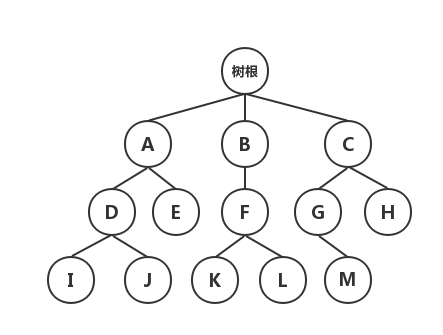
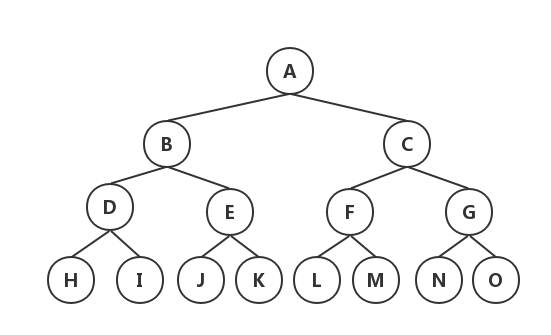

# 树结构
> 树（Tree）结构是一种描述`非线性关系`的数据结构。树是 n 个数据结点的集合，在该集合中包含一个根结点，根结点之下分布着一些互不交叉的子集合，，这些子集合也就是根结点的子树。



## 树结构的基本特征：
1. 在一个树结构中，有且仅有一个结点没有直接前驱（与其直接相连的**前**一个数据结点），这个结点就是树的 `根结点`。
2. 除根结点之外，其余每个结点有且仅有一个直接前驱。
3. 每个结点可以有任意多个直接后继（与其直接相连的**后**一个数据结点）。

> 从树的定义来看，树具有一种`层次结构`的性质；而从数学的角度来看，树具有一种`递归`的特性。

## 树结构的基本概念
- 父结点和子结点：每个结点的子树的`根`称为该结点的子结点；相应地，该结点被称为子结点的父结点。
- 兄弟结点：具有同一父结点的结点称为兄弟结点。
- `结点`的**度**：一个结点所包含（直接）子树的数量。
- `树`的**度**：该树所有结点中最大的（结点的）度。
- 叶结点：树中度为零的结点称为叶结点或终端结点。
- 分支结点：树中度不为零的结点称为分支结点或非终端结点。
- 结点的层数：结点的层数从树根开始计算，根结点为第1层、依次向下为第 2、3、...、n 层；树是一种层数结构，每个结点都处在一定的层次上。
- 树的**深度**：树中结点的最大层数称为树的深度。
- 有序树：若树中各结点的子树（兄弟结点）是按一定次序从左向右排的，称为有序树。
- 无序树：若树中各结点的子树（兄弟结点）未按一定次序从左向右排的，称为无序树。
- 森林：n(n > 0)棵互不相交的树的集合。

## 二叉树
> 二叉树（Binary Tree）是树结构的一种特殊形式，它是 n 个结点的集合，每个结点最多只能有**两个**子结点。二叉树的子树仍然是二叉树。二叉树一个结点对应的两棵子树分别称为`左子树`和`右子树`。由于子树有左右之分，因此二叉树是**有序树**。


### 二叉树分类
1. 满二叉树：在二叉树中除最后一层的叶结点外，每层的结点都有 2 个子结点。

2. 完全二叉树：在二叉树中除最后一层外，其余各层的**结点数**（2 ^ n）都达到最大个数，且最后一层叶结点按照从左向右的顺序连续存在，只缺最后一层右侧若干结点。


> 满二叉树一定是完全二叉树，而完全二叉树不一定是满二叉树。

### 二叉树的存储方式
#### 顺序存储
顺序存储二叉树，可以将其按层来存储，即先存储根结点，然后从左至右依次存储下一层结点的数据，...，直到所有的结点数据完全存储。


##### 性质
对于完全二叉树，如果树中包含 n 个结点，假设这些结点按照**顺序方式**存储；那么对于任意一个结点 m 来说，具有如下性质：（编号从 1 开始）

- 如果 `m != 1`，则结点 m 的父结点的编号为：`m/2` 。
- 如果 `2m <= n`，则结点 m 的左子树根的编号为 `2m`；若 `2m > n`，则无左子树，进一步也就没有右子树。
- 如果 `2m + 1 <= n`，则结点 m 的右子树根的编号为 `2m + 1`；若 `2m + 1 > n`，则无右子树。
> 对于完全二叉树，其**深度**为：`[log2n] + 1`。

#### 缺点
浪费存储空间，因为对于非完全二叉树，需要对其填充为完全二叉树，而这些填充的是无用数据。因此，顺序存储方式一般只适用于完全二叉树的情况。

#### 链式存储
与线性结构的链式存储类似，二叉树的链式存储结构包含结点元素以及分别指向左字数和右子树的指针。


## (链式)二叉树操作实例代码

### 数据准备
#### 定义二叉树结构

``` C
/** 树操作返回值 */
typedef enum {
    RetError            = -1,           // 操作出错
    RetFailure          = 0,            // 操作失败
    RetSuccess          = 1,            // 操作成功
}RetValue;


/** 树结点类型 */
typedef struct {
    char key[15];                       // 学号
    char name[20];                      // 姓名
    int age;                            // 年龄
}NodeData;

	
	
/** 树的最大结点数 */
#define MAX_LEN 100


typedef struct LinkedBinaryTree{
    NodeData nodeData;                  // 保存结点数据
    struct LinkedBinaryTree* parent;    // 保存父结点指针
    struct LinkedBinaryTree* left;      // 保存左子树结点指针
    struct LinkedBinaryTree* right;     // 保存右子树结点指针
}LBTType;
```

### 相关操作
####  初始化
``` C
LBTType* LBTreeInit()
{
    LBTType* root;
    if (!(root = (LBTType*)malloc(sizeof(LBTType))))
    {
        printf("无法分配树根内存，（链式）树初始化失败！\n");
        return NULL;
    }
    printf("请先输入一个根结点数据：学号 姓名 年龄\n");
    fflush(stdin);
    scanf("%s%s%d", root->nodeData.key, root->nodeData.name, &root->nodeData.age);
    root->parent = NULL;
    root->left   = NULL;
    root->right  = NULL;
    
    return root;
}
```

####  查找结点
``` C
LBTType* LBTreeFindByKey(LBTType* root, char* key)
{
    if (NULL == root)
    {
        return NULL;
    }
    LBTType* findNode = NULL;
    if (0 == strcmp(root->nodeData.key, key))
    {
        return root;
    }
    else
    {
        findNode = LBTreeFindByKey(root->left, key);    // 向左子树递归查找
        if (NULL != findNode)
        {
            return findNode;
        }
        findNode = LBTreeFindByKey(root->right, key);   // 向右子树递归查找
        if (NULL != findNode)
        {
            return findNode;
        }
        return NULL;    // 结点不存在
    }
}
```

#### 添加结点
``` C
RetValue LBTreeAdd(LBTType* root)
{
    if (NULL == root)
    {
        printf("树根结点指针不存在，无法添加新结点数据！\n");
        return RetError;
    }
    LBTType* newNode = NULL;
    if (!(newNode = (LBTType*)malloc(sizeof(LBTType))))
    {
        printf("无法分配新结点内存，（链式）树添加新结点失败！\n");
        return RetFailure;
    }
    LBTType* parentNode = NULL;
    char findKey[15];
    char menuOption;
    
    printf("请输入结点数据：学号 姓名 年龄\n");
    fflush(stdin);
    scanf("%s%s%d", newNode->nodeData.key, newNode->nodeData.name, &newNode->nodeData.age);
    
    newNode->left  = NULL;
    newNode->right = NULL;
    
    printf("请输入作为该结点的父结点的学号\n");
    fflush(stdin);
    scanf("%s", findKey);
    
    parentNode = LBTreeFindByKey(root, findKey);
    if (NULL == parentNode)
    {
        printf("未找到该父结点，添加新结点失败！\n");
        free(newNode);
        return RetFailure;
    }
    printf("1、添加该结点到左子树\n2、添加该结点到右子树\n0、取消\n");
    do
    {
        fflush(stdin);
        menuOption = getchar();
        menuOption -= '0';
        if (1 == menuOption)        // 添加到左子树
        {
            if (NULL != parentNode->left)
            {
                printf("左子树结点不为空，无法添加！\n");
            }
            else
            {
                parentNode->left = newNode;
                newNode->parent  = parentNode;
            }
        }
        else if (2 == menuOption)   // 添加到右子树
        {
            if (NULL != parentNode->right)
            {
                printf("右子树结点不为空，无法添加！\n");
            }
            else
            {
                parentNode->right = newNode;
                newNode->parent   = parentNode;
            }
        }
        else if (0 == menuOption)   // 取消
        {
            return RetFailure;
        }
    } while (1 != menuOption && 2 != menuOption && 0 != menuOption);
    
    printf("添加子结点成功！\n\n");
    return RetSuccess;
}
```

#### 获取左子树
``` C
LBTType* LBTreeLeft(LBTType* node)
{
    if (NULL == node)
    {
        printf("结点指针不存在，无法获取左子树结点！\n");
        return NULL;
    }
    return node->left;
}
```

#### 获取右子树
``` C
LBTType* LBTreeRight(LBTType* node)
{
    if (NULL == node)
    {
        printf("结点指针不存在，无法获取右子树结点！\n");
        return NULL;
    }
    return node->right;
}
```

#### 判断树是否为空
``` C
RetValue LBTreeIsEmpty(LBTType* root)
{
    if (NULL == root)
    {
        return RetFailure;
    }
    else
    {
        return RetSuccess;
    }
}
```

#### 计算二叉树深度
``` C
unsigned int LBTreeDepth(LBTType* root)
{
    if (NULL == root)       // 空树，深度为 0
    {
        return 0;
    }
    unsigned int leftDepth = LBTreeDepth(root->left);       // 递归计算左子树深度
    unsigned int rightDepth = LBTreeDepth(root->right);     // 递归计算左右树深度
    
    if (leftDepth > rightDepth)
    {
        return leftDepth + 1;
    }
    else
    {
        return rightDepth + 1;
    }
}
```

#### 清空二叉树
``` C
RetValue LBTreeClear(LBTType* root)
{
    if (NULL == root)
    {
        return RetSuccess;
    }
    LBTreeClear(root->left);    // 递归清空左子树
    LBTreeClear(root->right);   // 递归清空右子树
    
    free(root);     // 释放根结点
    root = NULL;
    
    return RetSuccess;
}
```

#### 显示结点数据
``` C
void LBTreeNodeData(LBTType* node)
{
    if (NULL == node)
    {
        return;
    }
    
    printf("key = %-15s name = %-20s age = %d\n", node->nodeData.key, node->nodeData.name, node->nodeData.age);
}
```

#### 按层遍历二叉树
``` C
void LBTreeLevelTraversal(LBTType* root, void (*LBTreeNodeData)(LBTType* nRoot))
{
    if (NULL == root)
    {
        printf("树根结点指针不存在，无法按层遍历二叉树数据！\n");
        return;
    }
    LBTType* tempRoot;
    LBTType* qTree[MAX_LEN];                    // 按层保存树结点循环队列
    unsigned int tail = 0;                      // 队尾（入队列）
    unsigned int head = 0;                      // 队头（出队列）
    
    qTree[tail] = root;                         // 二叉树根结点先入队列
    tail = (tail + 1) % MAX_LEN;
    
    while (head != tail)                        // 循环遍历队列数据
    {
        tempRoot = qTree[head];
        head = (head + 1) % MAX_LEN;
        
        LBTreeNodeData(tempRoot);               // 显示结点数据
        
        if (NULL != tempRoot->left)             // 存在左子树，则把左子树入队列
        {
            qTree[tail] = tempRoot->left;       // 左子树根结点入队列
            tail = (tail + 1) % MAX_LEN;
        }
        
        if (NULL != tempRoot->right)            // 存在右子树，则把右子树入队列
        {
            qTree[tail] = tempRoot->right;       // 右子树根结点入队列
            tail = (tail + 1) % MAX_LEN;
        }
    }
}
```

#### 先序（先根）遍历二叉树
``` C
void LBTreeDLRTraversal(LBTType* root, void (*LBTreeNodeData)(LBTType* nRoot))
{
    if (NULL == root)
    {
        return;
    }
    LBTreeNodeData(root);                               // 显示结点数据
    LBTreeDLRTraversal(root->left, LBTreeNodeData);     // 递归先序遍历左子树
    LBTreeDLRTraversal(root->right, LBTreeNodeData);    // 递归先序遍历右子树
}
```

#### 中序（中根）遍历二叉树
``` C
void LBTreeLDRTraversal(LBTType* root, void (*LBTreeNodeData)(LBTType* nRoot))
{
    if (NULL == root)
    {
        return;
    }
    
    LBTreeLDRTraversal(root->left, LBTreeNodeData);     // 递归中序遍历左子树
    LBTreeNodeData(root);                               // 显示结点数据
    LBTreeLDRTraversal(root->right, LBTreeNodeData);    // 递归中序遍历右子树
}
```

#### 后序（后根）遍历二叉树
``` C
void LBTreeLRDTraversal(LBTType* root, void (*LBTreeNodeData)(LBTType* nRoot))
{
    if (NULL == root)
    {
        return;
    }
    
    LBTreeLRDTraversal(root->left, LBTreeNodeData);     // 递归后序遍历左子树
    LBTreeLRDTraversal(root->right, LBTreeNodeData);    // 递归后序遍历右子树
    LBTreeNodeData(root);                               // 显示结点数据
}
```
