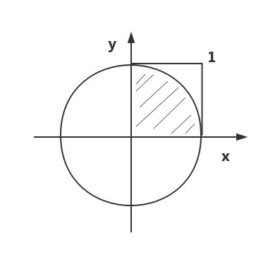

# 概率算法思想
> 概率算法（Probability）依照概率统计的思路来求解问题；但往往不能得到问题的精确解，却是通过数值计算来求解近似值。

## 执行过程
1. 将问题转化为相应的几何图形 **S**，**S**的面积是容易计算的，问题的结果往往对应几何图形中某一部分 **S1**的面积。
2. 然后，向几何图形中随机撒点。
3. 统计几何图形 **S** 和 **S1** 的点数。根据 **S** 的面积和 **S1** 面积的关系以及各图形中的点数来计算得到结果。
4. 判断上述结果是否在需要的精度之内，如果未达到精度则执行步骤 `2`；如果达到精度则输出近似值。

## 算法的形式
1. 数值概率算法。
2. 蒙特卡罗（Monte Carlo）算法。
3. 拉斯维加斯（Las Vegas）算法。
4. 舍伍德（Sherwood）算法。

# 示例
## 蒙特卡罗（Monte Carlo）—— π 算法


1. 如上图，设一个半径为 **1** 的圆，其面积为：`S = π * r * r = π，（r == 1）`。
2. 图中阴影部分是圆的 **1/4**，其面积为：`S1 = S / 4 = π / 4`。
3. 图中正方形的面积为：`S2 = r * r = 1`。

这样，按照图示建立一个坐标系，如果均匀地向正方形内撒点，那么落在阴影部分的点数与全部的点数之比应该是：`S阴影 / S正方形 = π / 4`。

根据概率统计的规律，只要撒的点足够多，那么将得到近似的结果。通过这个原理便可以计算*圆周率 π* 的近似值，这就是**蒙特卡罗 π 算法**。

> **注意：** 使用蒙特卡罗算法计算圆周率有两个关键点：

1. 均匀撒点：在 C 语言中可以使用随机函数来实现，产生 `[0,1]` 之间随机的坐标值 `[x,y]`。
2. 区域判断：图中阴影部分的特点是距离坐标原点的距离小于等于 `1`，这样就可以通过计算判断：`x*x + y*y <= 1` 来实现。


## 示例代码
``` C
#pragma mark --  蒙特卡罗算法计算圆周率 π
double MonteCarloPI(int pointCount)
{
    double approximatePi;
    double x, y;
    int sum = 0;
    
    srand((unsigned)time(NULL));
    for (int i = 0; i < pointCount; i++)
    {
        x = (double)rand()/RAND_MAX;            // 产生 0 ~ 1 之间的一个随机数
        y = (double)rand()/RAND_MAX;            // 产生 0 ~ 1 之间的一个随机数
        if (1 >= x * x + y * y)
        {
            sum++;                              // 统计落在圆内的点
        }
    }
    approximatePi = 4.0 * sum / pointCount;     // 计算 π 近似值
    
    return approximatePi;
}
```