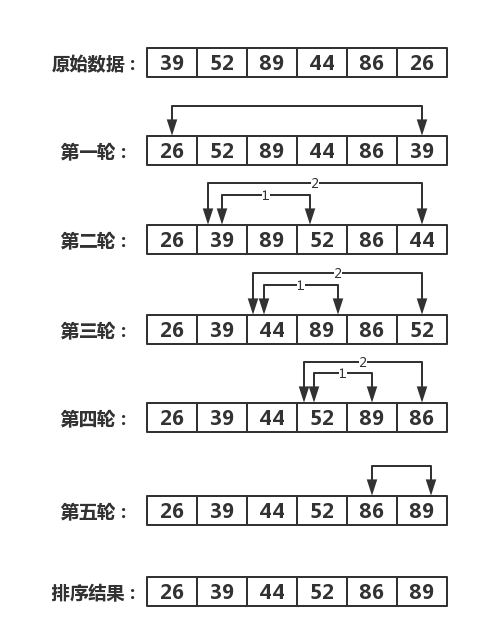

# 冒泡排序
> 冒泡排序（Bubble Sort）是所有排序算法中最简单的、最基本的一种；其思路就是交换排序，通过相邻数据的交换来达到排序的目的。

## 执行流程：
1. 对数组中的各数据，依次比较相邻的两个元素的大小。
2. 如果前面的数据大于（小于）后面的数据，就交换这两个数据。经过**第一轮**的多次比较排序后，便可把最小（大）的数据排好。
3. 然后，再用相同的方法把剩下的数据逐个进行比较，最后便可按照从小到大（从大到小）的顺序排好数组中各数据的顺序。

# 示例
> 排序原始数据：`39 52 89 44 86 26 `

## 升序排序（从小到大）：


排序后结果：`26 39 44 52 86 89`

### 示例代码
``` C
/** 冒泡排序操作返回值 */
typedef enum {
    RetError            = -1,           // 操作出错
    RetSuccess          = 0,            // 操作成功
} RetValue;


/** 排序类型 */
typedef enum {
    SortASC             = 0,            // 升序
    SortDES             = 1,            // 降序
}SortType;


RetValue BubbleSort(int* array, int len, SortType type)
{
    if (NULL == array || 0 >= len)
    {
        printf("数组不存在，无法对其进行冒泡排序！\n");
        return RetError;
    }
    
    for (int i = 0; i < len - 1; i++)
    {
        for (int j = i + 1; j < len; j++)
        {
            if (SortASC == type)
            {
                if (array[i] > array[j])
                {
                    int tem  = array[i];
                    array[i] = array[j];
                    array[j] = tem;
                }
            }
            else if (SortDES == type)
            {
                if (array[i] < array[j])
                {
                    int tem  = array[i];
                    array[i] = array[j];
                    array[j] = tem;
                }
            }
        }
        printf("第 %d 步结果：\t", i + 1);
        for (int k = 0; k < len; k++)
        {
            printf("%d\t", array[k]);
        }
        printf("\n");
    }
    return RetSuccess;
}
```